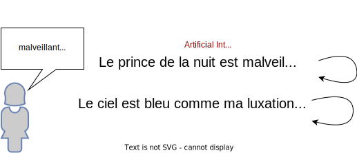

# **La Font-AI-ne**
## A French poetry generator

[project gutenberg]: https://www.gutenberg.org/

By SENECAT Loïc, PERSEE Ryan, RULLIER Germain

---

## The idea 

Wouldn't it be nice to have a tool that could generate poetry for you?

From a few words in input, the tool would generate a poem that would be coherent and rime.

And do it in the style of a famous poet?

---
## How it would work

